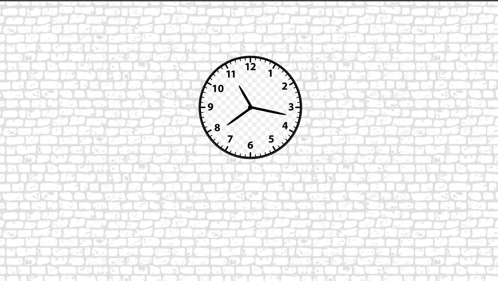
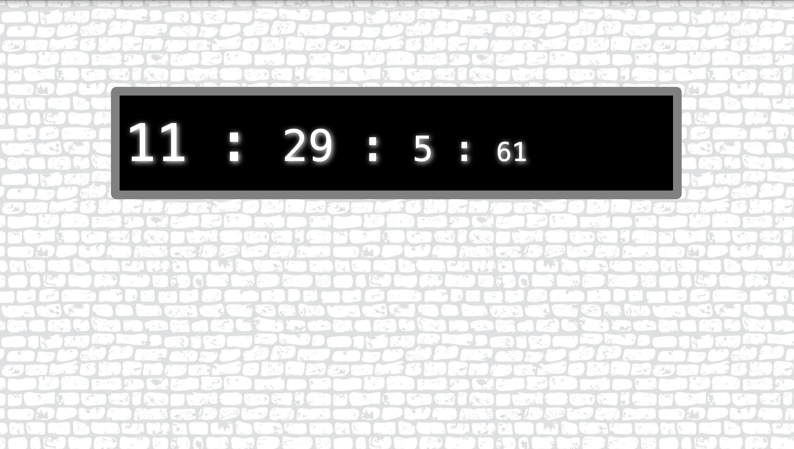

# Clock

1. **🧭 Analog Clock (Vanilla JavaScript)**
   Built using HTML, CSS, and pure JavaScript (no libraries or frameworks).

Displays a traditional clock interface with hour, minute, and second hands.

Uses setInterval() and DOM manipulation to update the time every second.

## Analog Clock

**💻 Digital Clock (React + Vite)**
Built using React with Vite for a fast and modern development setup.

Shows current time in digital format (HH:MM:SS:MS).

Components-based structure and efficient rendering using React state/hooks.

## Digital Clock

